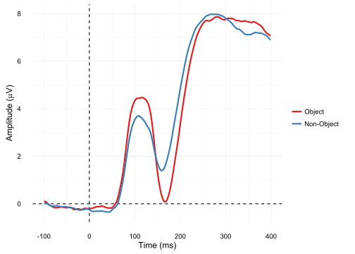
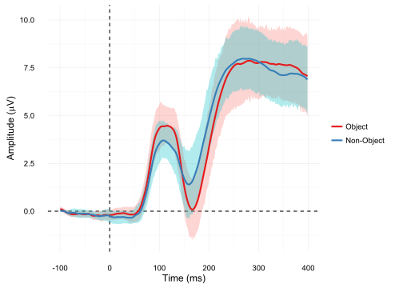
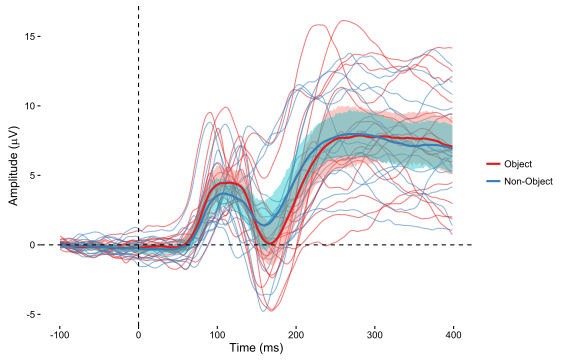
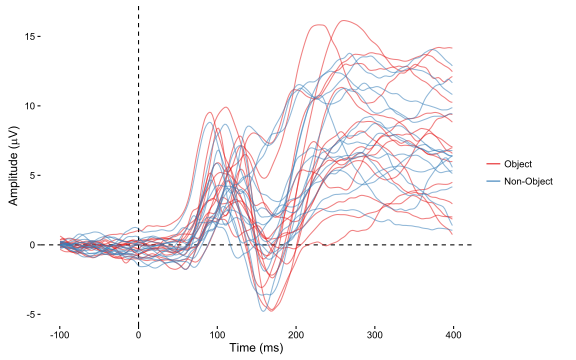
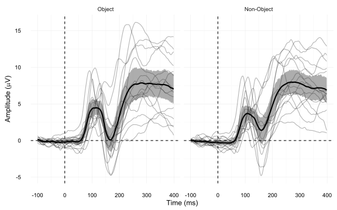
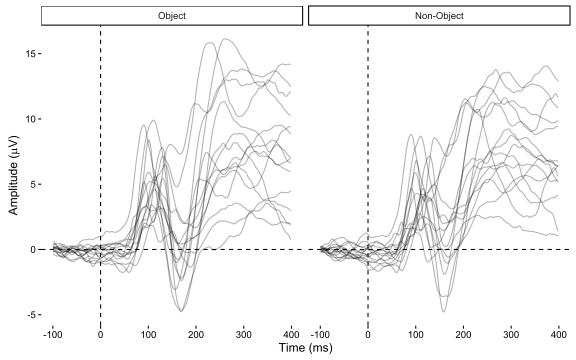
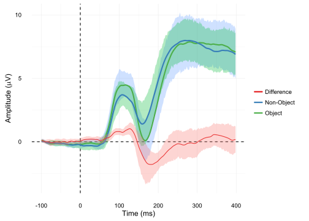
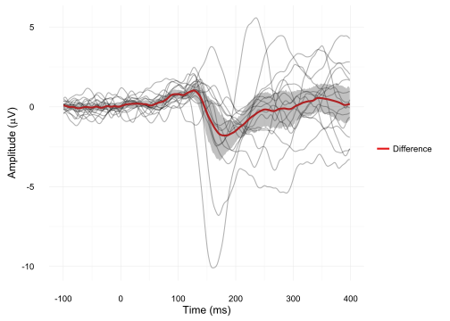

# ERP Visualization Part 1: Comparing two conditions


ERP visualization is harder than people think. Often people take the path of least resistance, plotting grand average ERP data as simple traces representing condition means, with no information regarding variability around these means. There are a couple of variations on this simple theme which show regions of significance, but it's extremely rare to show anything else. A new editorial letter by Rousselet, Foxe, and Bolam in the European Journal of Neuroscience offers some <a href ="http://http://onlinelibrary.wiley.com/doi/10.1111/ejn.13400/epdf">useful guidelines</a>, and Ana Todorovic's recent <a href="http://neuroanatody.com/2016/09/scatterplotting-time-series/">post on adding scatterplots to time-series data </a>is also great. 
I'm going to go through a few examples of plotting ERPs using R, including code throughout.


I do all my processing of EEG data in Matlab, using EEGLAB and ERPLAB, but I typically switch over to R when it's time to do the statistics on individual ERP components. In general I love the R package ggplot2 for graphs, so it feels natural to me to try plotting the ERPs using ggplot2. These posts are not intended to codify right or wrong answers on how to visually represent ERPs. Rather, they're my attempt to explore some of the options, get a feel for what's good and bad about each approach, and work out how to actually make these plots in R.

## The data

For convenience I've taken some data from a study that we published a last year <a href="#craddock">[1]</a>. We used a 2 x 3 factorial repeated measures design, with the factors Object (object vs non-object) and Spatial Frequency (high, broadband, low). Check out the article itself for more details. 

For this first post, I'm going to stick to the main effect of Object. I'll get on to the effect of frequency and the interaction in later posts, which will also be a good opportunity to show some of the difficulties with applying some of the guidelines from the letter to designs that have more than two conditions.

First up is some code to load in my pre-processed data and whip it into shape. The pre-processed data is four columns containing the amplitude value for each time point for each subject for each condition. We calculate differences between the conditions in a separate data frame (it makes my life a bit easier later on), then set up the basic plot format.


```r
library(ggplot2)
library(reshape2)
levCatGA <- read.csv("https://raw.githubusercontent.com/craddm/ExploringERPs/master/levCatObjNon.csv",header = FALSE)
names(levCatGA) <- c("Object","Non-Object","Time","Subject")
levCatGA <- levCatGA[(levCatGA$Time >= -100)& (levCatGA$Time <= 400),]
levCatDiff <- levCatGA
levCatDiff$Difference <- levCatGA[,1]-levCatGA[,2]
levCatDiff <- melt(levCatDiff[,3:5], id.vars = c("Subject","Time"))
names(levCatDiff) <- c("Subject","Time","condition","amplitude")
levCatGA$Subject <- as.factor(levCatGA$Subject)
levCatGA <- melt(levCatGA,id.vars = c("Subject","Time"))
names(levCatGA) <- c("Subject","Time","condition","amplitude")


levCat.plot <- ggplot(levCatGA,aes(Time,amplitude))+
  scale_color_brewer(palette = "Set1")+
  theme_classic()
```

## The Plots

Here's an example of a typical basic ERP plot:


```r
levCat.plot+
  stat_summary(fun.y = mean,geom = "line",size = 1,aes(colour = condition))+
  labs(x = "Time (ms)",y = expression(paste("Amplitude (",mu,"V)")),colour = "")+
  geom_vline(xintercept = 0,linetype = "dashed" )+
  geom_hline(yintercept = 0,linetype = "dashed")
```

<!-- -->

The individual lines are the condition means of the ERPs at a cluster of right occipital electrodes.

As you can see, there's no depiction of the variability around the condition means. The simplest way of showing this variability is to add some measure of dispersion around the mean. Let's add shaded areas representing 95% confidence intervals. These confidence intervals are bootstrapped, so if you reproduce this plot, they might differ slightly.


```r
levCat.plot+
  stat_summary(fun.data = mean_cl_boot,geom = "ribbon",size = 1,aes(fill = condition),alpha = 0.3)+
  guides(fill = "none")+
  stat_summary(fun.y = mean,geom = "line",size = 1,aes(colour = condition))+
  labs(x = "Time (ms)",y = expression(paste("Amplitude (",mu,"V)")),colour = "")+
  geom_vline(xintercept = 0,linetype = "dashed" )+
  geom_hline(yintercept = 0,linetype = "dashed")
```

<!-- -->

What do I learn from adding that? If my data were between-subjects, then the CI would help me make inferences from looking at the distance between the lines and shaded regions, and spot differences in variability across conditions.

However, my data is repeated measures, so these CIs are not massively helpful here. They show the between-subject variability for each condition, but what I'm interested in is the variability of the within-subject difference between the two conditions. I'll come back to this issue later.

Another way of showing the variability around the mean is to plot the individual subject data as well as the mean:


```r
levCat.plot+
  geom_line(aes(group = interaction(Subject,condition),colour = condition,alpha = 0.2))+
  guides(alpha= "none")+
  stat_summary(fun.data = mean_cl_boot,geom = "ribbon",alpha = 0.4,aes(fill = condition))+
  guides(fill= "none")+
  stat_summary(fun.y = mean,geom = "line",size = 1,aes(colour = condition))+
  labs(x = "Time (ms)",y = expression(paste("Amplitude (",mu,"V)")),colour = "")+
  geom_vline(xintercept = 0,linetype = "dashed" )+
  geom_hline(yintercept = 0,linetype = "dashed")
```

<!-- -->

I've also included here the CI around the condition means. As you can probably see, it's getting a little messy. It's hard to actually pick out individual subjects, and I have no idea which line belongs to which participant. Nevertheless, I can see the initial positive peaks kind of smear over what look like a bunch of short individual peaks that jitter around in time from 80 ms to 120 ms. And although a majority of participants seem to be showing a negative going deflection, peaking around 180 ms, some clearly aren't. Let's try without the group means:


```r
levCat.plot+
  geom_line(aes(group = interaction(Subject,condition),colour = condition,alpha = 0.2))+
  guides(alpha= "none")+
  labs(x = "Time (ms)",y = expression(paste("Amplitude (",mu,"V)")),colour = "")+
    geom_vline(xintercept = 0,linetype = "dashed" )+
  geom_hline(yintercept = 0,linetype = "dashed")
```

<!-- -->

Maybe a little better, but I'm struggling to differentiate lines from different conditions. Let's split the plot by condition to try to make things a little more readable.


```r
levCat.plot+
  facet_wrap(~condition)+
  geom_line(aes(group = Subject),alpha = 0.3)+
  stat_summary(fun.data = mean_cl_boot,geom = "ribbon",alpha = 0.4)+
  guides(fill= "none")+
  stat_summary(fun.y = mean,geom = "line",size = 1)+
  labs(x = "Time (ms)",y = expression(paste("Amplitude (",mu,"V)")),colour = "")+
  geom_vline(xintercept = 0,linetype = "dashed" )+
  geom_hline(yintercept = 0,linetype = "dashed")
```

<!-- -->

This is certainly an improvement for understanding the variability around the mean for each condition; here's one last go without the group means.


```r
levCat.plot+
  facet_wrap(~condition)+
  geom_line(aes(group = Subject),alpha = 0.3)+
  labs(x = "Time (ms)",y = expression(paste("Amplitude (",mu,"V)")),colour = "")+
  geom_vline(xintercept = 0,linetype = "dashed" )+
  geom_hline(yintercept = 0,linetype = "dashed")
```

<!-- -->

It's good, but personally I prefer to have the condition summary on there too. Another possibility would be to have a separate colour for each subject, so you'd know which lines belonged to the same subject across each plot. But it's hard to get enough distinctive colours, so this doesn't work too well.

## Difference waves

All well and good, but let's not forget that what we're really interested in is the difference between the two conditions. We can get at that by plotting the difference between them. Here's a plot showing the condition means and the difference wave, again with 95% bootstrapped confidence intervals. In this case, I've subtract the non-object condition from the object condition, so positive values in the difference wave indicate that the Object condition has higher amplitude, while negative values show that the non-object has higher amplitude.


```r
levCat.plot+
  guides(fill = "none")+
  labs(x = "Time (ms)", y = expression(paste("Amplitude (",mu,"V)")),colour = "")+
  stat_summary(fun.data = mean_cl_boot,geom = "ribbon",alpha = 0.3,aes(fill = condition))+
  stat_summary(fun.y = mean,geom = "line",size = 1,aes(colour = condition))+
  
  stat_summary(data = levCatDiff,fun.y=mean,geom = "line",aes(colour = condition))+
  stat_summary(data = levCatDiff,fun.data = mean_cl_boot,geom = "ribbon",alpha = 0.3,aes(fill = condition))+
   geom_vline(xintercept = 0,linetype = "dashed" )+
  geom_hline(yintercept = 0,linetype = "dashed")
```

<!-- -->

Note that the confidence interval round the difference wave *is* useful, which isn't really the case for the CIs around the condition means, since now it's showing the variability of the within-subject differences. There are couple of different ways to plot within-participant confidence intervals which you could plot around the condition means - I may get back to that some other time. But for the moment, let's keep going with the difference wave and let R handle the CIs. Let's try a version with both the group and individual difference waves, and without the condition means.


```r
levCatDiff.plot <- ggplot(levCatDiff,aes(Time,amplitude))+
  scale_color_brewer(palette = "Set1")+
  theme_classic()

levCatDiff.plot+
  labs(x = "Time (ms)", y = expression(paste("Amplitude (",mu,"V)")),colour = "")+
  stat_summary(fun.y=mean,geom = "line",aes(group = Subject),alpha = 0.3)+
  stat_summary(fun.y=mean,geom = "line",aes(colour = condition),size = 1)+
  stat_summary(fun.data = mean_cl_boot,geom = "ribbon",alpha = 0.3)+
   geom_vline(xintercept = 0,linetype = "dashed" )+
  geom_hline(yintercept = 0,linetype = "dashed")
```

<!-- -->

In this version of the plot you can see that the difference wave starts to diverge from zero at around 80 ms or so, peaking around 125ms and then reaching a nadir at around 180ms. The confidence intervals give a handy idea of where (uncorrected) tests would find significant differences between the two conditions. The individual waves show that there are a couple of participants who show much bigger negative deflections for objects than the other subjects, and at least one who seems to be going in the other direction at the time of the negative peak of the difference.

### References
<div id="craddock">
<p>Craddock, M., Martinovic, J., & Mueller, M. M. (2015). Early and late effects of objecthood and spatial frequency on event-related potentials and gamma band activity. BMC Neuroscience, 16(1), 6. <a href ="http://doi.org/10.1186/s12868-015-0144-8">doi</a></p>
</div>
